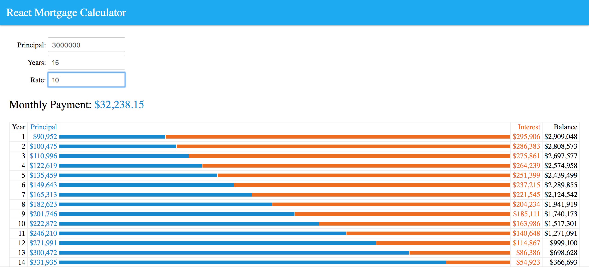

## React Mortgage Calculator

This app helps you calculate your mortgage payments by adding your principal payment, period in years applicable to the principal amount and the rate at which the mortgage was obtained.

**Install the app locally**

Clone the repository
> git clone https://github.com/wanjiku-carol/react-mortgage-calculator.git

On the terminal, cd into the directory:
> cd react-mortgage-calculator

Install the dependencies:
> npm install

Run the app:
> npm start

You can also view the deployed up [here](https://fierce-lake-71388.herokuapp.com/)

How to Calculate:
* Insert the principal amount
* Add the period in years
* Add the mortgage rate
* It should appear as follows:

